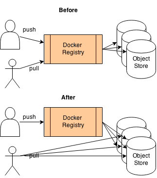

static-docker-registry
======================

This is a demonstration of making 'docker pull' more reliable.

Pull is made realible by having it fetch the image layers (and metadata) *directly* 
from the CDN instead of having to go throughly the comparably unreliable registry 
middleman.

In order to achieve this, we need four things:

1. [patch docker](https://github.com/dotcloud/docker/pull/4607) to make it ignore the 
   special X-* http headers if not present, even though it is not strictly required if 
   we add the headers to the endpoint app (see point 3).

2. [patch
   docker-registry](https://github.com/ActiveState/docker-registry/compare/static-registry)
   to store 'tags' and 'images' files under each repositority. this allows the
   docker client to directly request /tags and /images from the CDN. the /tags
   file in particular is required as it is not possible to enumerate the /tag_*
   files from the registry store. the patched version is available as a docker image -
   `docker pull srid/static-docker-registry`

3. the [endpoint web
   app](https://github.com/ActiveState/static-docker-registry/blob/master/endpoint) - a simple
   redirecting http proxy server that redirects on incoming requests to the CDN.

4. A distributed and reliable data store like openstack swift (or amazon s3) for use as the
   storage backend in docker-registry. the data files must be made publicly available via http 
   for use in the endpoint app.

Now what happens when you one runs 'docker pull' is:

* /v1/_ping is requested, and endpoint returns a 200 response

* docker proceeds to fetch metadata and layers

* for every request therein, the endpoint will respond with a http redirect to
  the corresponding CDN file.

* docker respects the redirect response, and fetches from the CDN.

As a result, 'docker pull' is made more reliable as it doesn't rely on a
registry middleman at all. The endpoint app is still useful as a federation
server so that "docker pull <myendpoint.com>/foo/myimg" knows where to go to
get the images from.

